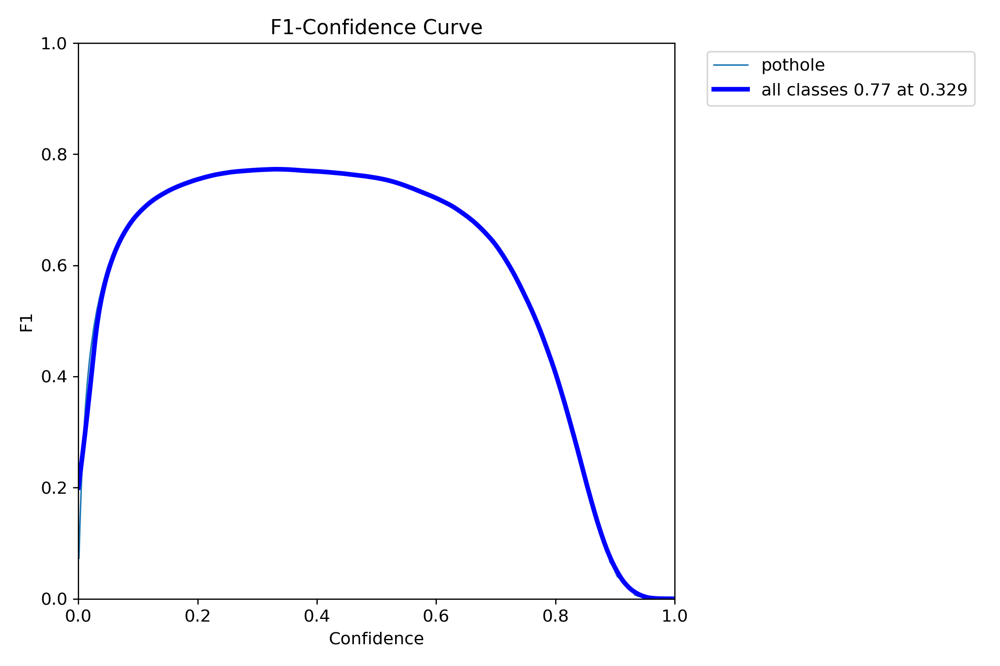
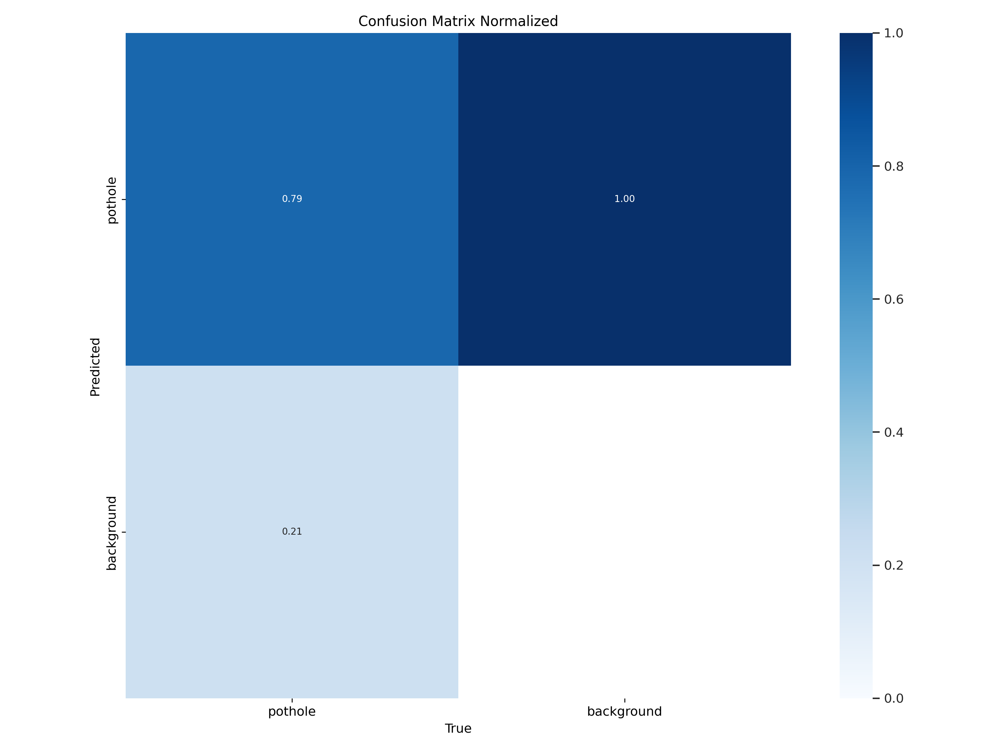
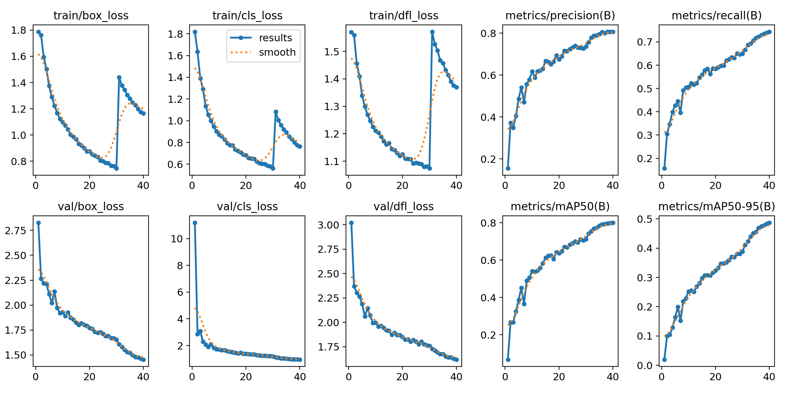
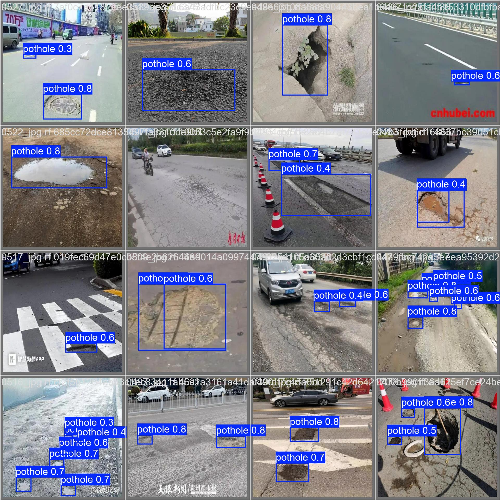

# 🕳️ Pothole Detection System using YOLOv9

A deep learning-powered computer vision system designed to automatically detect potholes in road imagery using the YOLOv9 object detection model. This project aims to streamline road maintenance operations by enabling automated, accurate pothole identification from images, videos, and live feeds.

---

## 📂 Dataset

We used the following dataset for training and validation:

> 📦 [Kaggle - Pothole Dataset](https://www.kaggle.com/datasets/ryukijanoramunae/pothole-dataset)

This dataset includes thousands of annotated images for pothole detection and is ideal for training object detection models.

---

## 🧠 Model Details

- **Model**: YOLOv9 (You Only Look Once - v9)
- **Framework**: PyTorch
- **Input Types**: Static images, video files, or webcam streams
- **Training Platform**: Trained on Modal’s cloud infrastructure with NVIDIA A100 GPU

---

## 🚀 Features

- ✅ High-speed real-time pothole detection
- ✅ Works with multiple input sources (images, videos, webcam)
- ✅ Easy to retrain with your own datasets
- ✅ Lightweight and deployment-ready

---
## 🧰 **Modal Deployment (Serverless GPU Training + Inference)**
This project uses Modal — a serverless cloud platform — to train and deploy YOLOv9 models in the cloud effortlessly.

🚀 Why Modal?
⚡ Fast GPU compute (NVIDIA A100 for training, T4 for inference)

💾 Persistent volumes for dataset and model storage

💸 Generous free tier ($5 in credits — great for experimenting)

✅ No infrastructure hassle (no Docker, no Kubernetes)

## 📸 Visual Demo

Here are some predictions generated by our model:

<p float="left">
  
  
  
  
  
</p>

---

## 📊 Performance Metrics

> 🧪 *The following metrics and charts summarize the model's evaluation on the validation dataset.*

### 📈 F1 Curve



### ❌ Confusion Matrix


### ✅ Results Summary




### 🖼️ Validation Batches


---

## ⚙️ How to Use

### 🔧 Installation

```bash
git clone https://github.com/swarnranjan/pothole
cd pothole
pip install -r requirements.txt
