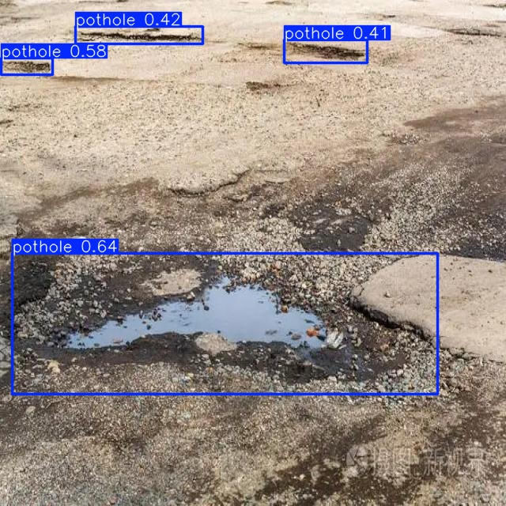
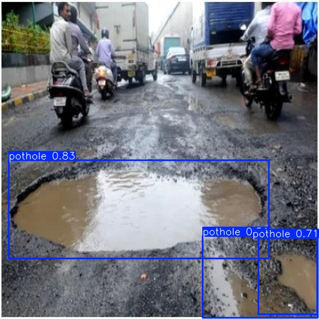
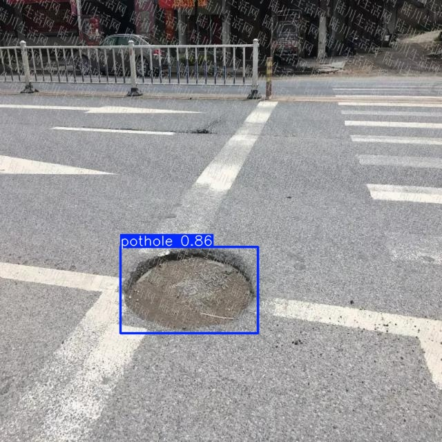
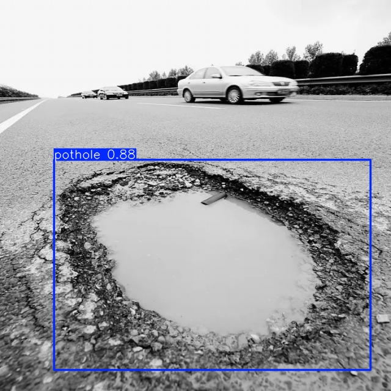
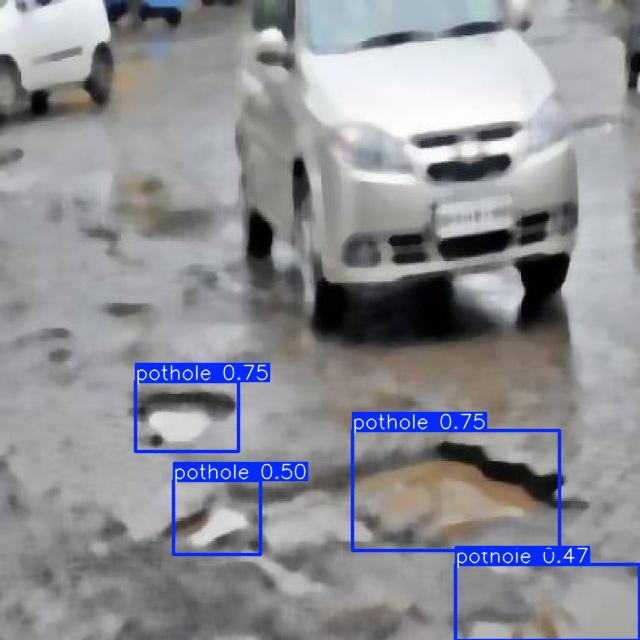

# 🕳️ Pothole Detection System using YOLOv9

## Description

A deep learning-based computer vision system for detecting potholes on roads using the YOLOv9 object detection model. This project is built to assist in smart road maintenance by automating pothole identification from images and videos. The model was trained using Modal's cloud infrastructure, leveraging an A100 GPU to accelerate the training process and improve overall performance.

## Contributors

- [Swarn](https://github.com/swarnranjan) - 
- [V Vinayak](https://github.com/Vink0217) - 
- [Vedant](https://github.com/) - 
- [Anoushka](https://github.com/) -
- [Hritik](https://github.com/) -
- [Naman](https://github.com/)

## 🚀 Features

- Powered by YOLOv9 for high accuracy and speed
- Works with images, videos, and webcam feeds
- Easily customizable for other object detection tasks
- Lightweight and efficient

## 📸 Demo

## 🧠 Model Details

- **Model**: YOLOv9 (You Only Look Once - v9)
- **Framework**: PyTorch
- **Input Types**: Images, videos, or live webcam
- **Training**: Fine-tuned on custom pothole dataset

